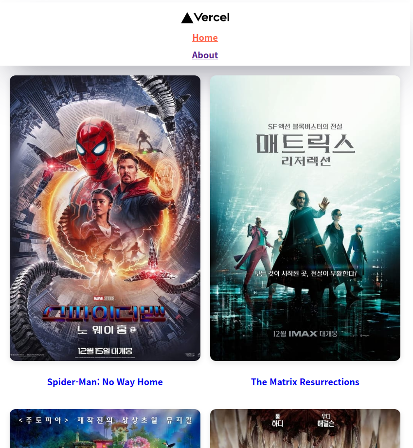

# bg-nextjs-basic

노마드 코더와 함께하는 nextjs 시작하기 21-12-23!

01-03에 완강

## 결과물

movie api (The Moive DB - api 밑 문서가 너무 좋아보인다)를 이용하여 만든 간단한 nextjs 사이트

## 배운것
- index.js, about.js 와 같은 파일시스템을 그대로 url 형태로 가져가는 시스템
- next/head를 이용한 Seo 컴포넌트 작성, Layout 에서 활용하기
- style jsx를 이용한 컴포넌트 내부의 스타일 작성
- api key를 숨기는 방법 (redirects, rewrites, process.env.API_KEY, .env.local)
  - react로 SPA로 작성하면 어떻게 숨기는지 궁금해짐(?)
- 니꼬쌤의 await 축약 코드 스타일 (try...catch는 어디로)
  - awaitable에 대한 이해가 좀 더 필요하다.
- getServerSideProps를 이용한 SSR 작성
  - Link에서 query로 masking 정보를 넘겨주면 과정이 어려워진다.
  - 마치 useState undefined 처럼 정보가 없을때 SSR을 하는것을 고려해서 작성해야한다. { title || [] }
  - next가 내부적으로 backend를 이용하고 있다는 것을 고려해도, router.query.params 등.
  - ctx (클라이언트 컨텍스트 등 문서를 보고 더 공부해야한다)
- 404 페이지 커스터마이징
- 내가 좋은 문서화 좋은 문서화 하지만 결국 좋은 문서화를 한 사이트에 들어가서 어떻게 하는지 따라하는게 큰 도움이 될것 같다는 생각이 들었다. 보통 컨트리 코드를 쓰라고 작성한 API와 달리 여기 TheMovieDB는 ISO 3166-1 을 언급하며 정확한 검색을 할 수 있게 도왔다.
